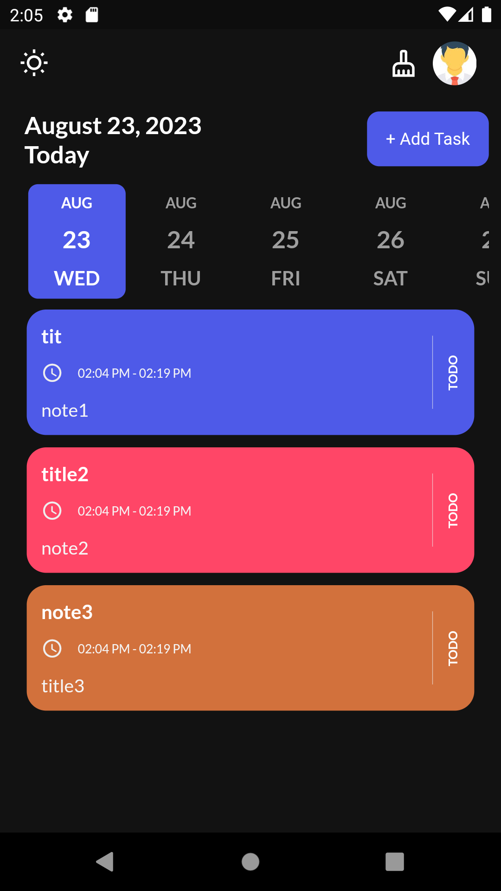
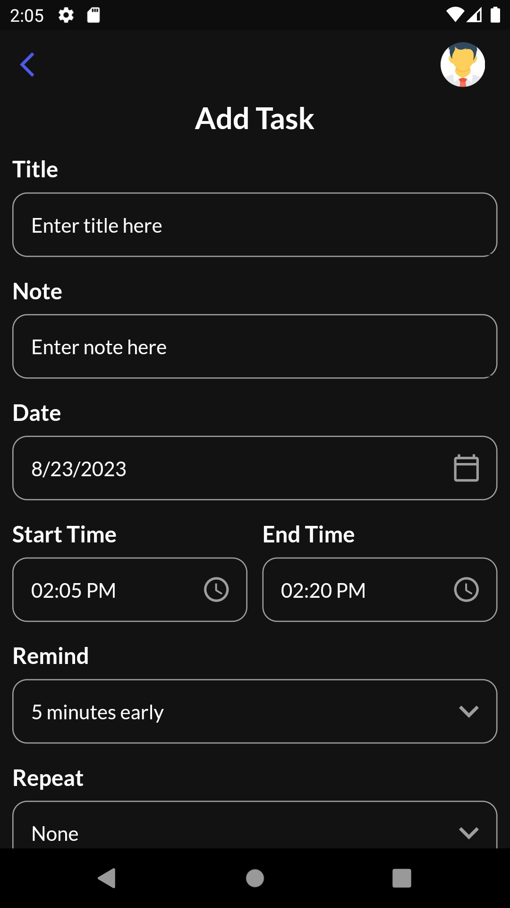

# TODO App with Flutter

A simple TODO app built using Flutter that helps you manage your tasks efficiently.  
This fork synchronizes your local tasks with Google Calendar using the official Google Calendar API.

> ⚠️ **Note:** This app uses **Google Calendar events**, not Google Tasks or Schedules!
> 
---
## Features

- Add tasks with due dates
- Edit existing tasks
- Mark tasks as completed
- Delete a single task or all tasks on a chosen date
- Set task colors
- Synchronize local tasks in the app with Google Calendar

---

## Screenshots





---

## Getting Started

Follow these instructions to get the project up and running on your local machine.

### Prerequisites

- Flutter SDK
- Tested on a desktop device

### Installation

1. Clone the repository:
```
    git clone https://github.com/your-username/todo-app-flutter.git
```
2. Navigate to the project directory:
```
    cd todo-app-flutter
```
3. Install dependencies:
```
    flutter pub get
```
3. Run the app:
```
    flutter run
```

---

### Environment Setup

Before running the app, configure your environment variables.  
You will need a **CLIENT_ID**, **CLIENT_SECRET**, and **CALENDAR_ID**.

1. Go to [Google Cloud Console](https://console.cloud.google.com/)
2. Create a new project (or select an existing one)
3. Enable the **Google Calendar API** for your project
4. Configure the **OAuth consent screen**
5. Create **OAuth 2.0 credentials** (choose **Desktop App** as the type)
6. Copy the generated **Client ID** and **Client Secret**
7. Go to [Google Calendar](https://calendar.google.com/)
8. Create a new calendar and copy its identifier  
    (for the default calendar, use `primary`)
9. Paste the credentials into `example.env` and rename it to `.env`

Your `.env` file should look like:
```
CLIENT_ID=<your_client_id> 
CLIENT_SECRET=<your_client_secret> 
CALENDAR_ID=<your_calendar_id>  # or CALENDAR_ID=primary
```

---

## Dependencies

The app uses the following packages:
```yaml
win32: ^5.0.8 
cupertino_icons: ^1.0.2 
get_storage: ^2.0.3 
get: ^4.6.6 
flutter_local_notifications: ^14.1.1 
intl: ^0.18.1 
google_fonts: ^5.1.0 
date_picker_timeline: ^1.2.3 
sqflite: ^2.0.0+4 
sqflite_common_ffi: ^2.3.0 
flutter_staggered_animations: ^1.0.0 
flutter_svg: ^2.0.7 
rxdart: ^0.27.2 
timezone: ^0.9.2 
flutter_timezone: ^1.0.7 
googleapis: ^13.1.0 
googleapis_auth: ^1.4.1 
google_sign_in: ^6.3.0 
http: ^1.1.0 
flutter_dotenv: ^5.0.2 
url_launcher: ^6.3.1
```

Add these dependencies to your `pubspec.yaml` before running the app.